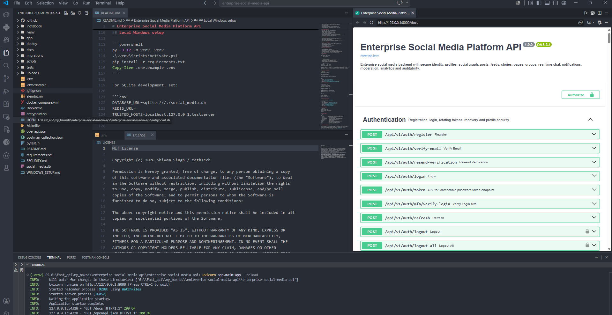

# Enterprise Social Media Platform API

A production-oriented Facebook-style backend built with FastAPI, SQLAlchemy 2, PostgreSQL, Redis and WebSockets. The project combines secure identity, a social graph, personalized feeds, publishing, stories, creator pages, communities, notifications, moderation, analytics and private real-time chat in one modular codebase.



## Major capabilities

### Identity and access

- Registration, email verification and secure login
- Argon2 password hashing
- Short-lived JWT access tokens
- Rotating refresh-token families with reuse detection
- Password recovery and account lockout
- TOTP multi-factor authentication and recovery codes
- Session/device visibility and revocation
- API keys, global RBAC, organization memberships and audit logs

### Social graph and profiles

- Public, friends-only, followers-only and private profiles
- Avatar, cover, biography, location and website metadata
- Follow and unfollow
- Friend requests, accept/reject/cancel and unfriend
- People discovery, followers, following and friend lists
- User blocking through the integrated chat/user safety APIs
- Verified-profile administration

### Publishing and feeds

- Text, media, link, share and scheduled posts
- Page and group publishing
- Images, video, audio and document metadata
- Hashtags, mentions, locations and feelings
- Personalized home feed and public explore feed
- User, page and group timelines
- Reactions, nested comments, replies and saved collections
- Immutable counters for reactions, comments, shares, views and followers
- 24-hour stories, story views and viewer lists

### Pages and groups

- Creator/business pages with administrators and editors
- Page followers, page timelines and verification-ready metadata
- Public, private and hidden groups
- Join requests, approvals, roles, mute/ban-ready membership states
- Group owners, administrators, moderators and members

### Moderation and analytics

- Reports for posts, comments, stories, pages, groups and users
- Moderator review, resolution, dismissal and content removal
- Profile verification controls
- Platform dashboard and creator analytics
- Trending hashtags
- Full administrative audit trail

### Real-time communication

- Direct, group and channel conversations
- Authenticated FastAPI WebSockets
- Typing indicators, presence and heartbeat handling
- Read/delivery receipts, reactions, pins and message editing
- File-upload metadata and local/cloud-compatible completion flows
- Redis cross-instance fan-out and a durable event outbox

## Architecture

```text
Web / Mobile / Admin Clients
            │
       REST + WebSocket
            │
      Nginx / API Gateway
            │
      FastAPI Application
  ┌─────────┼─────────────────────────────────────┐
  │ Identity│ Social Graph │ Feed/Posts │ Chat    │
  │ Pages   │ Groups       │ Moderation │ Analytics│
  └─────────┼─────────────────────────────────────┘
            │
    SQLAlchemy + Alembic
       │             │
 PostgreSQL       Redis Pub/Sub
       │             │
 Social Worker   Outbox Worker
```

The modular monolith is suitable for an initial production deployment and can later be separated into identity, graph, feed, media, notification, moderation and messaging services.

## Quick start with Docker

```powershell
Copy-Item .env.example .env
docker compose up --build
```

Seed demonstration data:

```powershell
docker compose exec api python -m scripts.seed
```

Open:

- Swagger: `http://localhost:8000/docs`
- ReDoc: `http://localhost:8000/redoc`
- Health: `http://localhost:8000/health/ready`
- WebSocket: `ws://localhost:8000/ws?token=<ACCESS_TOKEN>`

## Local Windows setup

```powershell
py -3.12 -m venv .venv
.\.venv\Scripts\Activate.ps1
pip install -r requirements.txt
Copy-Item .env.example .env
```

For SQLite development, set:

```env
DATABASE_URL=sqlite:///./social_media.db
REDIS_URL=
TRUSTED_HOSTS=localhost,127.0.0.1,testserver
```

Then run:

```powershell
alembic upgrade head
python -m scripts.seed
uvicorn app.main:app --reload
```

## Demonstration accounts

All seeded accounts use `Password@123`.

| Role                | Email                          |
| ------------------- | ------------------------------ |
| Super administrator | `admin@social.example.com`     |
| Social moderator    | `moderator@social.example.com` |
| Auditor             | `auditor@social.example.com`   |
| Creator             | `creator@social.example.com`   |
| Member Alice        | `alice@social.example.com`     |
| Member Bob          | `bob@social.example.com`       |

## Useful commands

```powershell
alembic upgrade head
python -m scripts.seed
python -m scripts.export_openapi
python -m scripts.generate_postman
pytest -q
```

## Project layout

```text
app/
  routes/              Authentication, social, chat and administration APIs
  services/            Identity, RBAC, chat and social-domain services
  models.py             SQLAlchemy domain models
  schemas.py            Identity and administration schemas
  social_schemas.py     Social graph, content and community schemas
  chat_schemas.py       Messaging and WebSocket schemas
  realtime.py           WebSocket and Redis fan-out hub
migrations/             Alembic revisions
scripts/                Seed, OpenAPI, Postman and worker commands
tests/                  End-to-end platform lifecycle tests
docs/                   Architecture and integration guides
deploy/                  Nginx reverse-proxy example
```

## Production guidance

Before handling real users, configure managed PostgreSQL and Redis, object storage with malware scanning, a CDN, HTTPS, secure cookie or mobile token storage, a real email provider, secret management, backups, observability, content-safety policies, data-retention rules and privacy/legal review. See `SECURITY.md`.
